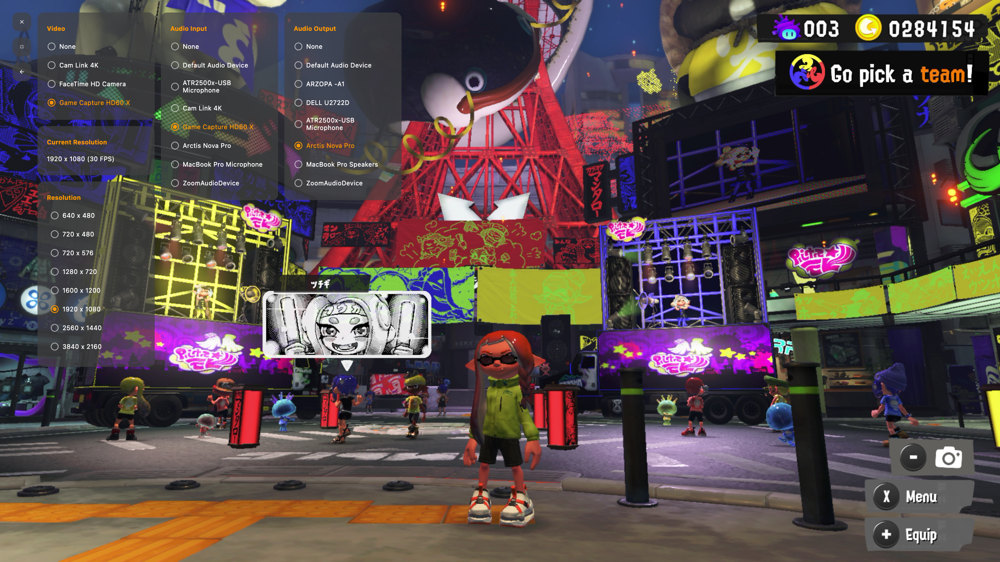
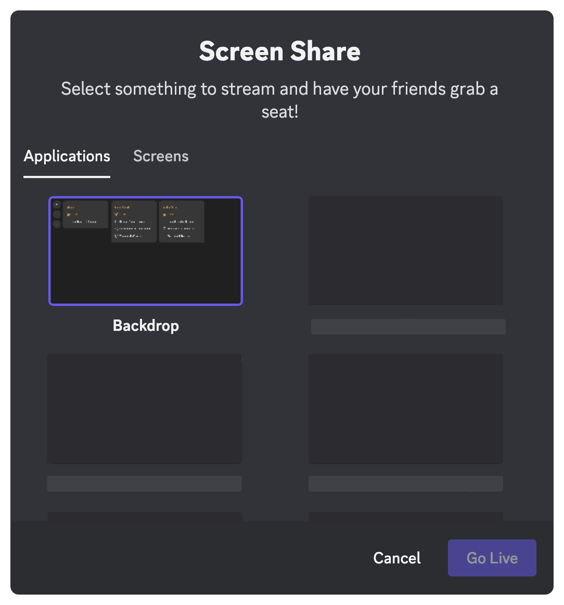
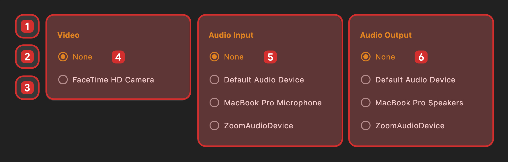

## Backdrop
Video and audio projection app for your streaming content on macOS

## Features
* Select and display video input properties supported
* Change video resolution supported
* Select audio input/output supported[build.gradle.kts](build.gradle.kts)
* Best for sharing your screen with friends on Live Streaming Apps like Discord

## Interface

1. Close app
2. Enter or exit fullscreen
3. Hide UI
4. Video input picker
5. Audio input picker
6. Audio output picker

## Powered by
* [Compose Multiplatform](https://www.jetbrains.com/lp/compose-multiplatform/)
* [Material 3](https://m3.material.io/)
* [Webcam Capture API](https://github.com/sarxos/webcam-capture)
* [Native Driver for Webcam Capture API](https://github.com/eduramiba/webcam-capture-driver-native)

## License
[Apache License, Version 2.0](./LICENSE.txt)
